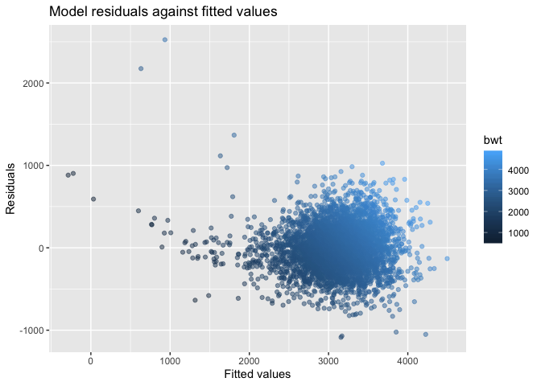

p8105\_hw6\_xh2395
================
Xin He
11/24/2019

``` r
library(tidyverse)
```

    ## ── Attaching packages ────────────────────────────────────────────────────────── tidyverse 1.2.1 ──

    ## ✔ ggplot2 3.2.1     ✔ purrr   0.3.2
    ## ✔ tibble  2.1.3     ✔ dplyr   0.8.3
    ## ✔ tidyr   1.0.0     ✔ stringr 1.4.0
    ## ✔ readr   1.3.1     ✔ forcats 0.4.0

    ## ── Conflicts ───────────────────────────────────────────────────────────── tidyverse_conflicts() ──
    ## ✖ dplyr::filter() masks stats::filter()
    ## ✖ dplyr::lag()    masks stats::lag()

``` r
library(modelr)
library(mgcv)
```

    ## Loading required package: nlme

    ## 
    ## Attaching package: 'nlme'

    ## The following object is masked from 'package:dplyr':
    ## 
    ##     collapse

    ## This is mgcv 1.8-28. For overview type 'help("mgcv-package")'.

## Problem 1

**Load the data**

``` r
birthweight_df =
  read_csv("./data/birthweight.csv") 
```

    ## Parsed with column specification:
    ## cols(
    ##   .default = col_double()
    ## )

    ## See spec(...) for full column specifications.

**Clean the data**

``` r
bw_clean = 
  birthweight_df %>% 
  mutate(
  babysex=as.factor(babysex),
  babysex=recode(babysex,"1"="male", "2"="female"),
  frace=as.factor(frace),
  frace=recode(frace,"1"="white", "2"="black","3"="asian", "4"="puerto rican", "8"="other","9"="unknown"),
  malform=as.factor(malform),
  malform=recode(malform,"1"="present", "0"="absent"),
  mrace=as.factor(mrace),
  mrace=recode(mrace, "1"="white", "2"="black","3"="asian", "4"="puerto rican", "8"="other"))
```

**Check missing data**

``` r
anyNA(bw_clean)
```

    ## [1] FALSE

There is no missing data in this dataset.

### Propose a regression model with all predictors

``` r
model_1 = lm(bwt ~ ., data = bw_clean)

summary(model_1)
```

    ## 
    ## Call:
    ## lm(formula = bwt ~ ., data = bw_clean)
    ## 
    ## Residuals:
    ##      Min       1Q   Median       3Q      Max 
    ## -1097.68  -184.86    -3.33   173.09  2344.15 
    ## 
    ## Coefficients: (3 not defined because of singularities)
    ##                     Estimate Std. Error t value Pr(>|t|)    
    ## (Intercept)       -6265.3914   660.4011  -9.487  < 2e-16 ***
    ## babysexfemale        28.7073     8.4652   3.391 0.000702 ***
    ## bhead               130.7781     3.4523  37.881  < 2e-16 ***
    ## blength              74.9536     2.0217  37.075  < 2e-16 ***
    ## delwt                 4.1007     0.3948  10.386  < 2e-16 ***
    ## fincome               0.2898     0.1795   1.614 0.106551    
    ## fraceblack           14.3313    46.1501   0.311 0.756168    
    ## fraceasian           21.2361    69.2960   0.306 0.759273    
    ## fracepuerto rican   -46.9962    44.6782  -1.052 0.292912    
    ## fraceother            4.2969    74.0741   0.058 0.953745    
    ## gaweeks              11.5494     1.4654   7.882 4.06e-15 ***
    ## malformpresent        9.7650    70.6259   0.138 0.890039    
    ## menarche             -3.5508     2.8951  -1.226 0.220083    
    ## mheight               9.7874    10.3116   0.949 0.342588    
    ## momage                0.7593     1.2221   0.621 0.534418    
    ## mraceblack         -151.4354    46.0453  -3.289 0.001014 ** 
    ## mraceasian          -91.3866    71.9190  -1.271 0.203908    
    ## mracepuerto rican   -56.4787    45.1369  -1.251 0.210901    
    ## parity               95.5411    40.4793   2.360 0.018307 *  
    ## pnumlbw                   NA         NA      NA       NA    
    ## pnumsga                   NA         NA      NA       NA    
    ## ppbmi                 4.3538    14.8913   0.292 0.770017    
    ## ppwt                 -3.4716     2.6121  -1.329 0.183913    
    ## smoken               -4.8544     0.5871  -8.269  < 2e-16 ***
    ## wtgain                    NA         NA      NA       NA    
    ## ---
    ## Signif. codes:  0 '***' 0.001 '**' 0.01 '*' 0.05 '.' 0.1 ' ' 1
    ## 
    ## Residual standard error: 272.5 on 4320 degrees of freedom
    ## Multiple R-squared:  0.7183, Adjusted R-squared:  0.717 
    ## F-statistic: 524.6 on 21 and 4320 DF,  p-value: < 2.2e-16

There are 3 variables not defined because of singularities: pnumlbw,
pnumsga, wtgain.

### Exclude pnumlbw, pnumsga, wtgain

``` r
model_2 = update(model_1, . ~ . -pnumlbw -pnumsga -wtgain)

summary(model_2)
```

    ## 
    ## Call:
    ## lm(formula = bwt ~ babysex + bhead + blength + delwt + fincome + 
    ##     frace + gaweeks + malform + menarche + mheight + momage + 
    ##     mrace + parity + ppbmi + ppwt + smoken, data = bw_clean)
    ## 
    ## Residuals:
    ##      Min       1Q   Median       3Q      Max 
    ## -1097.68  -184.86    -3.33   173.09  2344.15 
    ## 
    ## Coefficients:
    ##                     Estimate Std. Error t value Pr(>|t|)    
    ## (Intercept)       -6265.3914   660.4011  -9.487  < 2e-16 ***
    ## babysexfemale        28.7073     8.4652   3.391 0.000702 ***
    ## bhead               130.7781     3.4523  37.881  < 2e-16 ***
    ## blength              74.9536     2.0217  37.075  < 2e-16 ***
    ## delwt                 4.1007     0.3948  10.386  < 2e-16 ***
    ## fincome               0.2898     0.1795   1.614 0.106551    
    ## fraceblack           14.3313    46.1501   0.311 0.756168    
    ## fraceasian           21.2361    69.2960   0.306 0.759273    
    ## fracepuerto rican   -46.9962    44.6782  -1.052 0.292912    
    ## fraceother            4.2969    74.0741   0.058 0.953745    
    ## gaweeks              11.5494     1.4654   7.882 4.06e-15 ***
    ## malformpresent        9.7650    70.6259   0.138 0.890039    
    ## menarche             -3.5508     2.8951  -1.226 0.220083    
    ## mheight               9.7874    10.3116   0.949 0.342588    
    ## momage                0.7593     1.2221   0.621 0.534418    
    ## mraceblack         -151.4354    46.0453  -3.289 0.001014 ** 
    ## mraceasian          -91.3866    71.9190  -1.271 0.203908    
    ## mracepuerto rican   -56.4787    45.1369  -1.251 0.210901    
    ## parity               95.5411    40.4793   2.360 0.018307 *  
    ## ppbmi                 4.3538    14.8913   0.292 0.770017    
    ## ppwt                 -3.4716     2.6121  -1.329 0.183913    
    ## smoken               -4.8544     0.5871  -8.269  < 2e-16 ***
    ## ---
    ## Signif. codes:  0 '***' 0.001 '**' 0.01 '*' 0.05 '.' 0.1 ' ' 1
    ## 
    ## Residual standard error: 272.5 on 4320 degrees of freedom
    ## Multiple R-squared:  0.7183, Adjusted R-squared:  0.717 
    ## F-statistic: 524.6 on 21 and 4320 DF,  p-value: < 2.2e-16

There are some non-significant variables. Since all frace-related
variables are non-significant, we can exclude frace.

### Exclude frace

``` r
model_3 = update(model_2, . ~ . -frace)

summary(model_3)
```

    ## 
    ## Call:
    ## lm(formula = bwt ~ babysex + bhead + blength + delwt + fincome + 
    ##     gaweeks + malform + menarche + mheight + momage + mrace + 
    ##     parity + ppbmi + ppwt + smoken, data = bw_clean)
    ## 
    ## Residuals:
    ##     Min      1Q  Median      3Q     Max 
    ## -1097.2  -185.0    -3.4   173.5  2343.0 
    ## 
    ## Coefficients:
    ##                     Estimate Std. Error t value Pr(>|t|)    
    ## (Intercept)       -6275.7539   660.1055  -9.507  < 2e-16 ***
    ## babysexfemale        28.6774     8.4624   3.389 0.000708 ***
    ## bhead               130.7957     3.4498  37.914  < 2e-16 ***
    ## blength              74.9120     2.0205  37.075  < 2e-16 ***
    ## delwt                 4.0999     0.3945  10.392  < 2e-16 ***
    ## fincome               0.2900     0.1792   1.619 0.105601    
    ## gaweeks              11.5653     1.4649   7.895 3.65e-15 ***
    ## malformpresent        9.8604    70.6042   0.140 0.888937    
    ## menarche             -3.6117     2.8923  -1.249 0.211826    
    ## mheight               9.9748    10.3066   0.968 0.333191    
    ## momage                0.7549     1.2207   0.618 0.536323    
    ## mraceblack         -137.2032    10.2150 -13.432  < 2e-16 ***
    ## mraceasian          -73.8582    42.7892  -1.726 0.084402 .  
    ## mracepuerto rican   -99.1585    19.3862  -5.115 3.28e-07 ***
    ## parity               95.6671    40.4678   2.364 0.018121 *  
    ## ppbmi                 4.5635    14.8839   0.307 0.759159    
    ## ppwt                 -3.5082     2.6110  -1.344 0.179136    
    ## smoken               -4.8281     0.5860  -8.239 2.29e-16 ***
    ## ---
    ## Signif. codes:  0 '***' 0.001 '**' 0.01 '*' 0.05 '.' 0.1 ' ' 1
    ## 
    ## Residual standard error: 272.4 on 4324 degrees of freedom
    ## Multiple R-squared:  0.7182, Adjusted R-squared:  0.7171 
    ## F-statistic: 648.3 on 17 and 4324 DF,  p-value: < 2.2e-16

There are still some non-significant variables. We can exclude these
with big p-values (\>0.5): malform, momage, ppbmi.

### Exclude malform, momage, ppbmi

``` r
model_4 = update(model_3, . ~ . -malform -momage -ppbmi)

summary(model_4)
```

    ## 
    ## Call:
    ## lm(formula = bwt ~ babysex + bhead + blength + delwt + fincome + 
    ##     gaweeks + menarche + mheight + mrace + parity + ppwt + smoken, 
    ##     data = bw_clean)
    ## 
    ## Residuals:
    ##      Min       1Q   Median       3Q      Max 
    ## -1096.14  -184.98    -2.86   173.65  2343.59 
    ## 
    ## Coefficients:
    ##                     Estimate Std. Error t value Pr(>|t|)    
    ## (Intercept)       -6070.1897   139.7308 -43.442  < 2e-16 ***
    ## babysexfemale        28.4769     8.4548   3.368 0.000763 ***
    ## bhead               130.8513     3.4470  37.961  < 2e-16 ***
    ## blength              74.8931     2.0195  37.085  < 2e-16 ***
    ## delwt                 4.0794     0.3927  10.387  < 2e-16 ***
    ## fincome               0.3149     0.1748   1.802 0.071621 .  
    ## gaweeks              11.6105     1.4621   7.941 2.54e-15 ***
    ## menarche             -3.2979     2.8383  -1.162 0.245327    
    ## mheight               6.8542     1.7988   3.810 0.000141 ***
    ## mraceblack         -138.7506     9.9068 -14.006  < 2e-16 ***
    ## mraceasian          -71.4559    42.4158  -1.685 0.092128 .  
    ## mracepuerto rican  -100.1555    19.3291  -5.182 2.30e-07 ***
    ## parity               97.3088    40.3438   2.412 0.015907 *  
    ## ppwt                 -2.6787     0.4273  -6.268 4.01e-10 ***
    ## smoken               -4.8305     0.5857  -8.248  < 2e-16 ***
    ## ---
    ## Signif. codes:  0 '***' 0.001 '**' 0.01 '*' 0.05 '.' 0.1 ' ' 1
    ## 
    ## Residual standard error: 272.3 on 4327 degrees of freedom
    ## Multiple R-squared:  0.7182, Adjusted R-squared:  0.7173 
    ## F-statistic: 787.7 on 14 and 4327 DF,  p-value: < 2.2e-16

The p-value of menarche is still bigger than 0.1, we can exclude it.

### Exclude menarche

``` r
model_5 = update(model_4, . ~ . -menarche)

summary(model_5)
```

    ## 
    ## Call:
    ## lm(formula = bwt ~ babysex + bhead + blength + delwt + fincome + 
    ##     gaweeks + mheight + mrace + parity + ppwt + smoken, data = bw_clean)
    ## 
    ## Residuals:
    ##      Min       1Q   Median       3Q      Max 
    ## -1097.18  -185.52    -3.39   174.14  2353.44 
    ## 
    ## Coefficients:
    ##                     Estimate Std. Error t value Pr(>|t|)    
    ## (Intercept)       -6098.8219   137.5463 -44.340  < 2e-16 ***
    ## babysexfemale        28.5580     8.4549   3.378 0.000737 ***
    ## bhead               130.7770     3.4466  37.944  < 2e-16 ***
    ## blength              74.9471     2.0190  37.120  < 2e-16 ***
    ## delwt                 4.1067     0.3921  10.475  < 2e-16 ***
    ## fincome               0.3180     0.1747   1.820 0.068844 .  
    ## gaweeks              11.5925     1.4621   7.929 2.79e-15 ***
    ## mheight               6.5940     1.7849   3.694 0.000223 ***
    ## mraceblack         -138.7925     9.9071 -14.009  < 2e-16 ***
    ## mraceasian          -74.8868    42.3146  -1.770 0.076837 .  
    ## mracepuerto rican  -100.6781    19.3247  -5.210 1.98e-07 ***
    ## parity               96.3047    40.3362   2.388 0.017004 *  
    ## ppwt                 -2.6756     0.4274  -6.261 4.20e-10 ***
    ## smoken               -4.8434     0.5856  -8.271  < 2e-16 ***
    ## ---
    ## Signif. codes:  0 '***' 0.001 '**' 0.01 '*' 0.05 '.' 0.1 ' ' 1
    ## 
    ## Residual standard error: 272.3 on 4328 degrees of freedom
    ## Multiple R-squared:  0.7181, Adjusted R-squared:  0.7173 
    ## F-statistic: 848.1 on 13 and 4328 DF,  p-value: < 2.2e-16

Now, the variable mrace has the biggest p-value. Let’s try to exlude it.

### Exclude mrace

``` r
model_6 = update(model_5, . ~ . -mrace)

summary(model_6)
```

    ## 
    ## Call:
    ## lm(formula = bwt ~ babysex + bhead + blength + delwt + fincome + 
    ##     gaweeks + mheight + parity + ppwt + smoken, data = bw_clean)
    ## 
    ## Residuals:
    ##      Min       1Q   Median       3Q      Max 
    ## -1086.86  -180.66    -5.85   175.33  2524.46 
    ## 
    ## Coefficients:
    ##                 Estimate Std. Error t value Pr(>|t|)    
    ## (Intercept)   -6596.2111   134.9699 -48.872  < 2e-16 ***
    ## babysexfemale    29.9526     8.6308   3.470 0.000525 ***
    ## bhead           134.6172     3.5025  38.435  < 2e-16 ***
    ## blength          77.6256     2.0548  37.779  < 2e-16 ***
    ## delwt             3.8538     0.4001   9.633  < 2e-16 ***
    ## fincome           1.2231     0.1661   7.365 2.11e-13 ***
    ## gaweeks          13.1753     1.4897   8.844  < 2e-16 ***
    ## mheight           8.0715     1.7886   4.513 6.57e-06 ***
    ## parity          104.0734    41.2279   2.524 0.011627 *  
    ## ppwt             -2.6870     0.4365  -6.155 8.18e-10 ***
    ## smoken           -2.6944     0.5775  -4.666 3.17e-06 ***
    ## ---
    ## Signif. codes:  0 '***' 0.001 '**' 0.01 '*' 0.05 '.' 0.1 ' ' 1
    ## 
    ## Residual standard error: 278.4 on 4331 degrees of freedom
    ## Multiple R-squared:  0.7052, Adjusted R-squared:  0.7045 
    ## F-statistic:  1036 on 10 and 4331 DF,  p-value: < 2.2e-16

Now, all left variables are with a significant p-value.

**The final model:**

lm(formula = bwt ~ babysex + bhead + blength + delwt + fincome + gaweeks
+ mheight + parity + ppwt + smoken, data = bw\_clean)

**tidy and table the final model**

``` r
model_6 %>% 
  broom::tidy() %>% 
  knitr::kable()
```

| term          |      estimate |   std.error |   statistic |   p.value |
| :------------ | ------------: | ----------: | ----------: | --------: |
| (Intercept)   | \-6596.211135 | 134.9698546 | \-48.871736 | 0.0000000 |
| babysexfemale |     29.952607 |   8.6308243 |    3.470423 | 0.0005247 |
| bhead         |    134.617221 |   3.5024750 |   38.434884 | 0.0000000 |
| blength       |     77.625574 |   2.0547527 |   37.778548 | 0.0000000 |
| delwt         |      3.853828 |   0.4000760 |    9.632738 | 0.0000000 |
| fincome       |      1.223105 |   0.1660675 |    7.365107 | 0.0000000 |
| gaweeks       |     13.175271 |   1.4896837 |    8.844341 | 0.0000000 |
| mheight       |      8.071515 |   1.7886410 |    4.512652 | 0.0000066 |
| parity        |    104.073425 |  41.2278892 |    2.524345 | 0.0116268 |
| ppwt          |    \-2.686993 |   0.4365473 |  \-6.155102 | 0.0000000 |
| smoken        |    \-2.694421 |   0.5774787 |  \-4.665837 | 0.0000032 |

**Plot of model residuals against fitted values**

``` r
bw_clean %>% 
modelr::add_residuals(model_6) %>% 
modelr::add_predictions(model_6) %>% 
  ggplot(aes(x = pred, y = resid)) + 
  geom_point()+
  labs(
    title = 'Model residuals against fitted values',
    x = 'Fitted values',
    y = 'Residuals'
  )
```

<!-- -->
